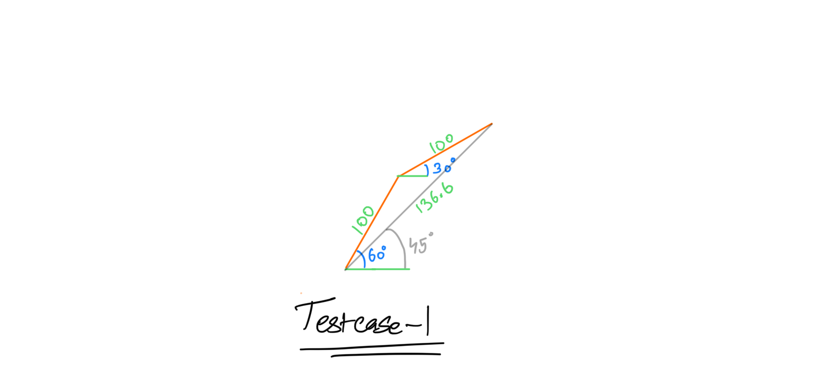
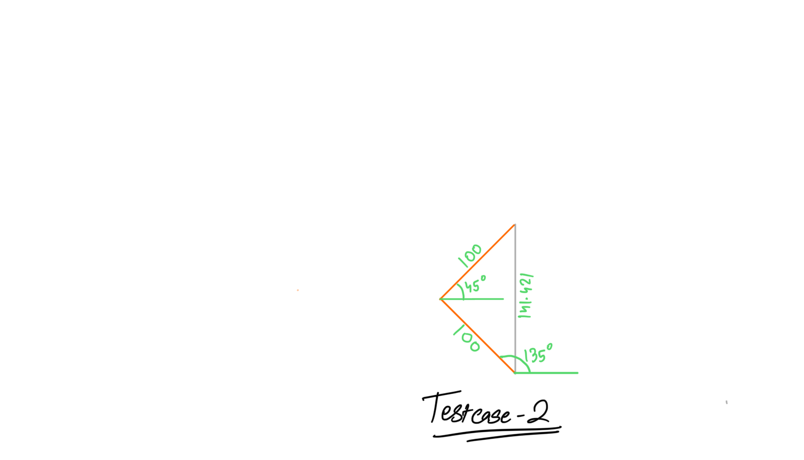

Problem Statement 2

# 2 Limb Inverse Kinematics

This problem is fairly simple. The goal is for the 2 arms joined with a joint to follow the mouse pointer. The armature is fixed at the origin. For it to work you are expected to make a code that runs and determines the angle (in degrees) of both the arms from the horizontal axis, such that when both the arms are at this position, they touch the mouse pointer. There are multiple such sets of values possible for this problem, any one of them is acceptable. The maximum and minimum angle between the arms is provided as an input.

All angles are in degrees.

----
Input and output are to be queried indefinitely.

**Input**:

The first line of input is 2 float values (alpha, beta) of the current angles (in degrees) of both the arms from the horizontal axis, in the negative direction separated by a space. \
The second line of input is 2 floats (l1, l2), the length of the 2 arms. \
The third line of input is 2 floats (rx, ry), the coordinates of the mouse pointer. \
The fourth line of input is 2 float values (minAngle, maxAngle), the maximum and minimum values (in degrees) of (alpha - beta)


**Output**:

Output is a single line countaining the predicted alpha and beta separated by space.

---------------------

Testcase 1:

Input:
```
135.000 45.000
100 100
136.602 136.602
0 180
```

Expected Output:
```
30 60
```
or
```
60 30
```
or
```
300 330
```
or
```
330 300
```

Explanation: \


---------------------

Testcase 2:

Input:
```
90 90
100 100
0 141.421
0 180
```

Expected Output:
```
135 45
```
or 
```
45 135
```
or
```
225 315
```
or 
```
315 225
```

Explanation: \



---------------------

Testcase 3:-

Input:
```
90 90
100 100
141.421 0
0 180
```
Expected Output:
```
-45 45
```
or
```
45 -45
```
or 
```
45 135
```

---------------------

Testcase 4:-

Input:
```
90 0
30 50
40 0
0 180
```
Expected Output:
```
90 143.13
```
